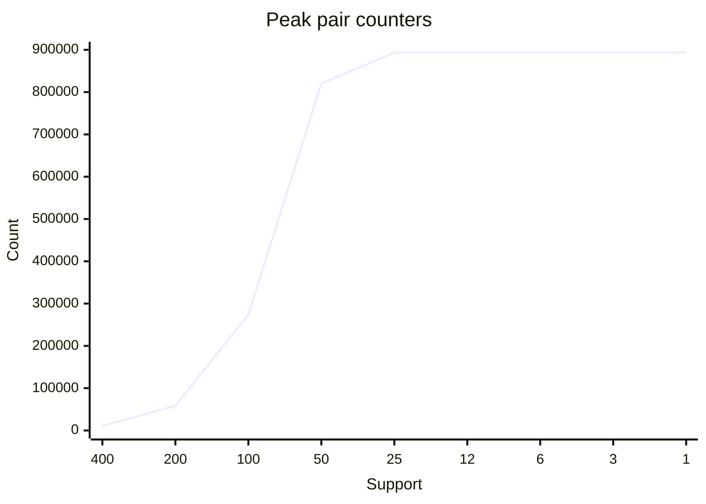
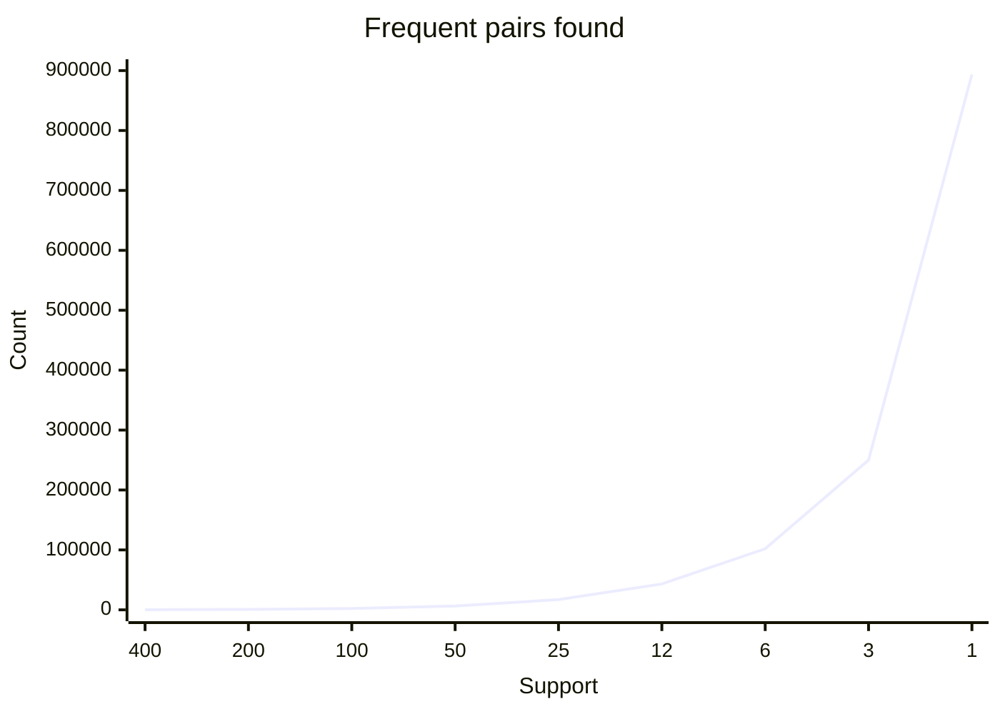

# Task 2 — Support Thresholds and Pair-Counter Growth

## Measurement Environment and Method

- CPU: Intel(R) Core(TM) Ultra 5 228V; RAM: 31.51 GiB; available RAM at the start: 14.48 GiB.
- Measurements ran on Windows 11 with Python 3.14.3 in a Codex desktop session. The sandbox could not retrieve the full host process list, so other running applications could not be identified.
- The standard dataset uses seed 246, 20,000 baskets, and 2,000 items. The supplied `bench.py` was unchanged. Reported times are elapsed times with `tracemalloc` enabled.
- `peak_bytes` measures peak Python allocations traced during algorithm execution. It excludes previously generated baskets, interpreter overhead, and other processes; it is not total process RSS. MB means 1,000,000 bytes.

## Standard Dataset: Nine Thresholds Spanning 400x

| Support | Frequent pairs | Peak counters | Seconds | Peak MB | Counter growth |
|---:|---:|---:|---:|---:|---:|
| 400 | 249 | 10,585 | 1.11 | 1.14 | — |
| 200 | 776 | 58,626 | 1.53 | 6.71 | 5.54× |
| 100 | 2,244 | 273,701 | 3.32 | 28.56 | 4.67× |
| 50 | 6,397 | 820,259 | 2.77 | 107.75 | 3.00× |
| 25 | 17,045 | 893,456 | 3.40 | 107.74 | 1.09× |
| 12 | 43,116 | 893,456 | 3.23 | 109.85 | 1.00× |
| 6 | 101,938 | 893,456 | 3.07 | 126.49 | 1.00× |
| 3 | 250,054 | 893,456 | 3.36 | 163.72 | 1.00× |
| 1 | 893,456 | 893,456 | 4.09 | 334.15 | 1.00× |

## Growth Curves

The x-axis lists support values in descending order with categorical spacing. Both charts use the same y-axis range.





## A2: Where the Experiment Stopped

The standard dataset completed down to support 1 without actual memory exhaustion or intolerable delay. The largest allocation peak was 334.15 MB, and the longest run took 4.09 seconds. Support is a positive integer, so it cannot be lowered further. The standard dataset did not expose the machine's physical limit requested by A2.

A separate, reproducible stress experiment expanded the dataset to 20,000 items and 40,000 baskets, with 40 Zipf-distributed draws per basket. It used an artificial stopping budget of 256 MiB in traced allocations or 30 seconds.

| Support | Processed baskets | Peak counters | Peak MB | Seconds | Result |
|---:|---:|---:|---:|---:|---|
| 400 | 40,000 | 87,918 | 14.13 | 1.26 | completed |
| 200 | 40,000 | 470,828 | 54.35 | 3.02 | completed |
| 100 | 40,000 | 1,852,619 | 215.95 | 5.62 | completed |
| 50 | 15,900 | 2,803,634 | 431.64 | 4.22 | stopped at artificial 256 MiB allocation budget |

The expanded run stopped at support 50 after processing 15,900 baskets, with 2,803,634 pair counters and a 431.64 MB allocation peak. Transient peaks during `Counter` dictionary resizing and checks every 100 baskets allowed the measured peak to overshoot the 256 MiB budget. The incomplete run's frequent-pair count is recorded as `null`. This was an experiment-budget stop, not exhaustion of the host's approximately 31.51 GiB RAM.

## A4–A5: Counters Versus Answers

As support fell from 400 to 200 to 100 to 50, counter counts grew by 5.54x, 4.67x, and 3.00x, respectively—more than doubling at each step. The expanding frequent-singleton set increases the possible pair space quadratically. From 50 to 25, counters grew only 1.09x; at support 25 and below, all items survived and counters saturated at 893,456 observed pairs.

From support 400 to 50, answers increased from 249 to 6,397 (25.69x), while counters increased from 10,585 to 820,259 (77.49x). At support 50, about 128.2 counters were maintained per answer. Counters include rarely co-occurring pairs, but only pairs meeting the support threshold become answers.

From support 25 to 1, however, counters stayed constant while answers increased from 17,045 to 893,456. Answer growth is therefore not slower in every range. At support 1, every observed pair becomes an answer, closing the gap; the returned dictionary and `frozenset` objects add further memory costs.

## Reproduction

```powershell
cd w06-apriori
python task2_explosion.py --supports 400,200,100,50,25,12,6,3,1
python stress.py
python experiments.py
```

Rerunning `task2_explosion.py` appends measurements to `explosion.json`. The standard-data table above reports the original nine runs.
