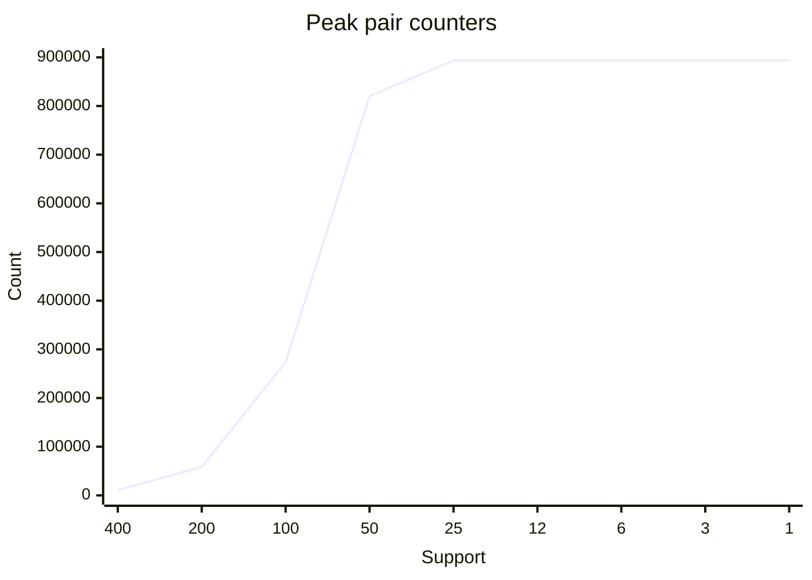
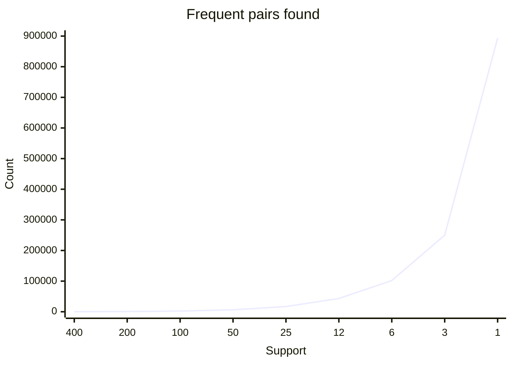

# Task 2 — 임계값과 쌍 카운터 증가

## 측정 환경과 방법

- CPU: Intel(R) Core(TM) Ultra 5 228V; RAM: 31.51 GiB; 시작 시 사용 가능 RAM: 14.48 GiB입니다.
- Windows 11, Python 3.14.3, Codex 데스크톱 세션에서 측정했습니다. 샌드박스에서 전체 호스트 프로세스 목록을 조회할 수 없어 다른 실행 프로그램은 확인하지 못했습니다.
- 기본 데이터는 seed 246, 20,000개 장바구니, 2,000개 항목이며 bench.py를 수정하지 않았습니다. 시간은 tracemalloc을 켠 실제 경과 시간입니다.
- peak_bytes는 알고리즘 실행 중 Python이 추적한 할당 피크입니다. 이미 생성된 장바구니, 인터프리터 및 다른 프로세스 메모리는 포함하지 않으므로 전체 프로세스 RSS가 아닙니다. MB는 1,000,000바이트입니다.

## 기본 데이터: 9개 임계값, 400배 범위

| Support | Frequent pairs | Peak counters | Seconds | Peak MB | Counter growth |
|---:|---:|---:|---:|---:|---:|
| 400 | 249 | 10,585 | 1.11 | 1.14 | — |
| 200 | 776 | 58,626 | 1.53 | 6.71 | 5.54× |
| 100 | 2,244 | 273,701 | 3.32 | 28.56 | 4.67× |
| 50 | 6,397 | 820,259 | 2.77 | 107.75 | 3.00× |
| 25 | 17,045 | 893,456 | 3.40 | 107.74 | 1.09× |
| 12 | 43,116 | 893,456 | 3.23 | 109.85 | 1.00× |
| 6 | 101,938 | 893,456 | 3.07 | 126.49 | 1.00× |
| 3 | 250,054 | 893,456 | 3.36 | 163.72 | 1.00× |
| 1 | 893,456 | 893,456 | 4.09 | 334.15 | 1.00× |

## 증가 곡선

각 차트의 x축은 내림차순 support이며 간격은 범주 간격입니다. 두 차트는 동일한 y축 범위를 사용합니다.





## A2: 어디에서 멈췄는지

기본 데이터는 support 1까지 모두 완료했으며 머신의 실제 메모리 부족이나 견디기 어려운 지연이 발생하지 않았습니다. 최대 피크는 334.15 MB, 최대 실행 시간은 4.09초였습니다. Support는 양의 정수이므로 이 데이터에서 더 낮출 수 없습니다. 실제 머신의 한계를 찾았다고 주장하지 않으며, 기본 데이터만으로는 A2의 물리적 한계를 관찰하지 못했습니다.

추가로 항목 20,000개, 장바구니 40,000개, 장바구니당 40회 Zipf 추출로 범위를 확장했습니다. 이는 제공 데이터와 별도인 재현 가능한 통제 실험이며, 추적 할당 256 MiB 또는 30초에서 중단하는 예산을 적용했습니다.

| Support | Processed baskets | Peak counters | Peak MB | Seconds | Result |
|---:|---:|---:|---:|---:|---|
| 400 | 40,000 | 87,918 | 14.13 | 1.26 | completed |
| 200 | 40,000 | 470,828 | 54.35 | 3.02 | completed |
| 100 | 40,000 | 1,852,619 | 215.95 | 5.62 | completed |
| 50 | 15,900 | 2,803,634 | 431.64 | 4.22 | stopped at artificial 256 MiB allocation budget |

확장 데이터는 support 50에서 15,900개 장바구니 처리 후 메모리 예산 때문에 중단했습니다. 쌍 카운터는 2,803,634개였고 피크는 431.64 MB였습니다. Counter 딕셔너리 재할당 중의 일시적 피크와 100개 장바구니 단위 점검 때문에 256 MiB 예산을 초과했습니다. 미완료 실행의 빈발쌍 수는 null로 기록했습니다. 이 중단은 설정한 실험 예산의 한계이며, 약 31.51 GiB 호스트 RAM의 고갈을 의미하지 않습니다.

## A4–A5: 카운터와 답의 차이

Support 400→200→100→50에서 카운터 증가율은 5.54×, 4.67×, 3.00×로 단순한 두 배보다 컸습니다. 빈발 singleton 집합이 커지면서 가능한 쌍 수가 제곱으로 늘어나기 때문입니다. 50→25에서는 1.09×만 증가했고, 25 이하에서는 모든 항목이 통과하여 실제 관측 쌍 893,456개에서 포화되었습니다.

400→50에서 정답은 249→6,397개(25.69×), 카운터는 10,585→820,259개(77.49×)로 늘었습니다. Support 50에서는 정답 하나당 약 128.2개의 카운터를 유지했습니다. 카운터는 드물게 동시 출현한 쌍까지 저장하지만 정답은 threshold를 넘은 쌍뿐이므로 차이가 생깁니다.

그러나 25→1에서는 카운터 수가 일정하고 정답 수는 17,045→893,456개로 증가했습니다. 따라서 모든 구간에서 정답 증가가 느리다고 일반화할 수 없습니다. Support 1에서는 관측 쌍이 모두 정답이 되어 격차가 없어지고, 반환 결과 딕셔너리와 frozenset 저장 비용으로 메모리가 추가 증가했습니다.

## 재현

```powershell
cd w06-apriori
python task2_explosion.py --supports 400,200,100,50,25,12,6,3,1
python stress.py
python experiments.py
```

task2_explosion.py를 다시 실행하면 explosion.json에 새 측정이 추가됩니다. 이 표는 최초 9개 실행 결과입니다.
